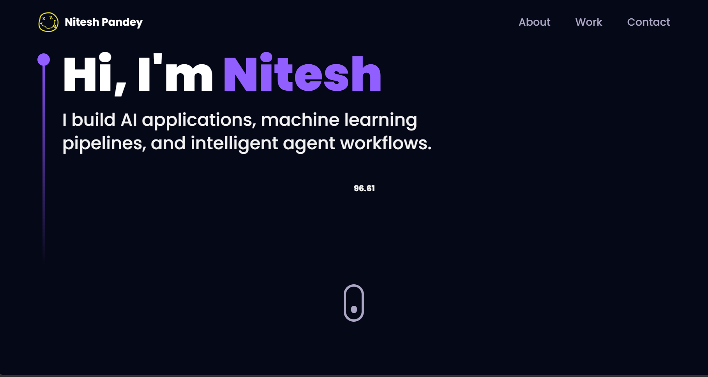

# Nitesh Pandey — 3D Portfolio



## 🚀 About This Portfolio

This is my personal 3D developer portfolio built using React, TypeScript, Three.js, Tailwind CSS, and Framer Motion.
It showcases my skills, projects, experience, and contact details through an interactive and modern 3D web experience.

## ✨ Features

* Interactive 3D hero section
* Smooth animations
* Responsive design
* Project showcase section
* Skills and technologies section
* Contact form integration
* Modern UI with Tailwind CSS
* Fast Vite-based development setup

## 🛠️ Tech Stack

* React.js
* TypeScript
* Vite
* Three.js
* React Three Fiber
* Framer Motion
* Tailwind CSS
* EmailJS
* Vercel

## 📦 Installation

Clone the repository:

```bash
git clone https://github.com/nitesh-kumar-pandey/portfolio.git
```

Go to the project folder:

```bash
cd portfolio
```

Install dependencies:

```bash
npm install
```

Run the development server:

```bash
npm run dev
```

Open in browser:

```text
http://localhost:5173
```

## 🔐 Environment Variables

Create a `.env` file in the root folder and add your EmailJS credentials:

```env
VITE_EMAILJS_SERVICE_ID=your_service_id
VITE_EMAILJS_TEMPLATE_ID=your_template_id
VITE_EMAIL_JS_ACCESS_TOKEN=your_access_token
```

## 📜 Available Scripts

| Command            | Description                    |
| ------------------ | ------------------------------ |
| `npm install`      | Install dependencies           |
| `npm run dev`      | Start local development server |
| `npm run build`    | Create production build        |
| `npm run preview`  | Preview production build       |
| `npm run lint`     | Run linting                    |
| `npm run ts:check` | Run TypeScript checks          |

## 🌐 Deployment

This project can be deployed on:

* Vercel
* Netlify
* GitHub Pages

Recommended deployment:

```bash
npm run build
```

Then deploy the generated production build.

## 🙏 Credits

This portfolio is customized and maintained by **Nitesh Pandey**.

Original template/design credits go to:

* Original Creator: [ladunjexa](https://github.com/ladunjexa)
* Original Repository: [reactjs18-3d-portfolio](https://github.com/ladunjexa/reactjs18-3d-portfolio)
* Inspired by JavaScript Mastery 3D portfolio concepts

The original project structure, 3D assets, and base design were adapted and customized for my personal portfolio.

## 📄 License

This project follows the original MIT License.

## 👨‍💻 Author

**Nitesh Pandey**

* GitHub: [nitesh-kumar-pandey](https://github.com/nitesh-kumar-pandey)
* Portfolio Repository: [portfolio](https://github.com/nitesh-kumar-pandey/portfolio)
